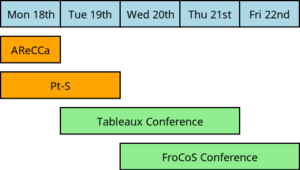

# Registration

## Registration system

The registration for Tableaux and FroCoS 2023 in now open.  Please register here:

[https://webapp.uibk.ac.at/tableaux2023/](https://webapp.uibk.ac.at/tableaux2023/){:target="_blank"}.

## Events

You can register for a single conference, or for a combination of events:

* The program starts on Monday 18th September 2023 with two [Tableaux-affiliated **workshops**](http://tableaux2023.tableaux-ar.org/workshops.html).
* The main **Tableaux** conference track is from **Tuesday** 19th **to Thursday** 21th.
* The main **FroCoS** conference track is from **Wednesday** 20th **to Friday** 22st.
* The joint <b>excursion and conference dinner</b> for both Tableaux and FroCoS is planned for **Wednesday** 20th afternoon/evening.

The following is a brief program overview.

[Here](http://tableaux2023.tableaux-ar.org/workshops.html) you can find more information about the Tableaux workshops.

## Prices 

| Event         | Early     | Late |
|--------------|-----------|------------|
| FroCoS conference | 350 | 450 |
| Tableaux+FroCoS | 450 | 550        |
| Tableaux conference | 400  | 500        |
| Tableaux+Workshops | 450 | 550        |
| all events | 550      | 650        |

All prices are in EUR.
The early registration prices are available up to **17th August (GMT time zone)**.  The late prices will take effect from 18th August (GMT).

**Note** that for each paper accepted to FroCoS one author additionally needs to pay Springer open-access fee of 240 EUR (which includes VAT).

